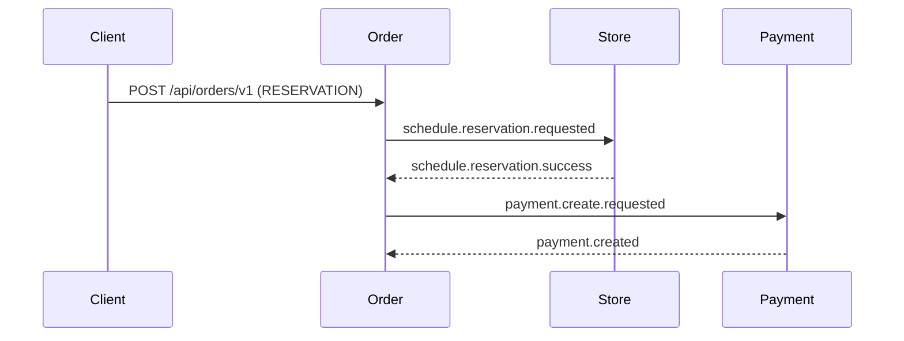
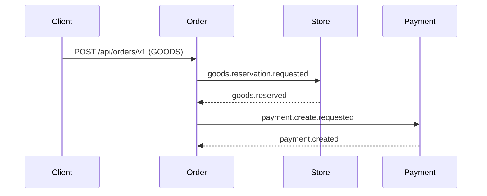
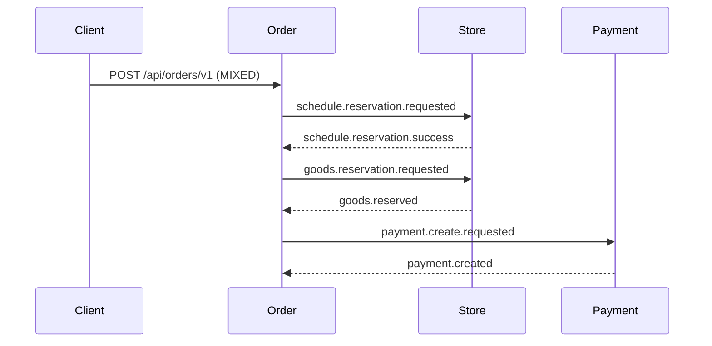
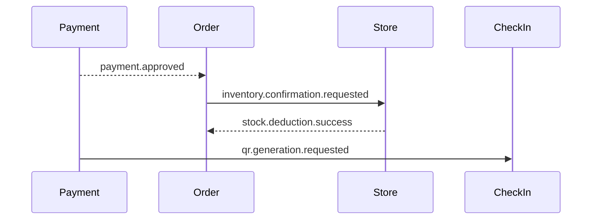

# 주요 흐름 시퀀스 (Mermaid)

> 아래 다이어그램은 핵심 경로만 요약합니다.

## 1) 예약 전용 주문

```mermaid
sequenceDiagram
    participant Client
    participant Order
    participant Store
    participant Payment

    Client->>Order: POST /api/orders/v1 (RESERVATION)
    Order->>Store: schedule.reservation.requested
    Store-->>Order: schedule.reservation.success
    Order->>Payment: payment.create.requested
    Payment-->>Order: payment.created
```

## 2) 굿즈 전용 주문

```mermaid
sequenceDiagram
    participant Client
    participant Order
    participant Store
    participant Payment

    Client->>Order: POST /api/orders/v1 (GOODS)
    Order->>Store: goods.reservation.requested
    Store-->>Order: goods.reserved
    Order->>Payment: payment.create.requested
    Payment-->>Order: payment.created
```

## 3) 복합 주문 (MIXED)

```mermaid
sequenceDiagram
    participant Client
    participant Order
    participant Store
    participant Payment

    Client->>Order: POST /api/orders/v1 (MIXED)
    Order->>Store: schedule.reservation.requested
    Store-->>Order: schedule.reservation.success
    Order->>Store: goods.reservation.requested
    Store-->>Order: goods.reserved
    Order->>Payment: payment.create.requested
    Payment-->>Order: payment.created
```

## 4) 결제 승인 이후

```mermaid
sequenceDiagram
    participant Payment
    participant Order
    participant Store
    participant CheckIn

    Payment-->>Order: payment.approved
    Order->>Store: inventory.confirmation.requested
    Store-->>Order: stock.deduction.success
    Payment->>CheckIn: qr.generation.requested
```

